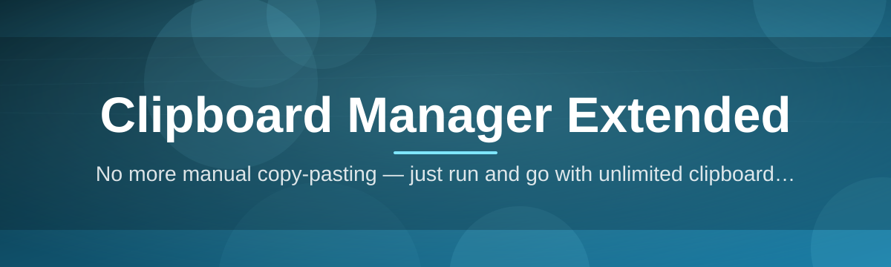
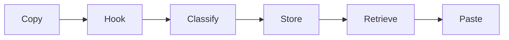

# clipboard-manager-suite 📋✨

  

*Your clipboard, remembered — a persistent, searchable history layer for everything you copy.*

  

## 🧭 Overview

Every operating system treats the clipboard as a single, disposable slot — copy something new, and whatever came before is gone forever. **clipboard-manager-suite** exists because that design assumption stopped matching how people actually work. Developers juggle snippets between terminals and editors, writers move paragraphs between drafts, support teams paste the same canned replies dozens of times a day — and all of them lose data every time they hit `Ctrl+C` twice in a row. This project rebuilds the clipboard as a durable, queryable timeline instead of a single volatile register.

Architecturally, this is less a "utility" and more a small, focused database sitting quietly between your input devices and the applications you paste into. It listens to clipboard change events at the OS level, classifies and stores each entry with minimal overhead, and exposes that history through a fast, keyboard-first interface. The goal was never to add more UI to look at — it's to remove the *cognitive tax* of remembering what you copied five minutes ago.

This tool is built for power users first: engineers who move structured data between tools, analysts pulling numbers from spreadsheets into reports, and anyone whose workflow depends on short-term memory that a clipboard normally throws away. It is a standalone Windows application — no background services phoning out, no accounts, no cloud sync by default. The clipboard is personal data, and the suite is designed to treat it that way.

---

## 🧩 What Sets It Apart

The clipboard manager space is crowded with tools that just show a list. Here's what makes this one built to last:

- **Persistent history, not a session cache** — entries survive reboots, application crashes, and even Explorer restarts, because history is written to a lightweight local store rather than kept only in memory.

- **Type-aware capture** — plain text, rich text, images, and file paths are each stored with their native format intact, so pasting a screenshot back out doesn't degrade it into a filename.

- **Instant fuzzy search** — a single keystroke drops you into a search box that filters thousands of historical entries in real time, ranked by relevance and recency.

- **Pinning and collections** — frequently reused snippets (signatures, boilerplate code, addresses) can be pinned so they never scroll out of reach, independent of how much you copy afterward.

- **Sensitive-data awareness** — password manager copies and other flagged patterns can be automatically excluded from persistent storage, so your history doesn't quietly become a security liability.

- **Low-footprint background operation** — the capture engine is designed to sit near-idle on CPU and memory until you actually invoke the interface, so it never competes with the app you're actually working in.

- **Portable, offline-first design** — no mandatory network calls, no telemetry beacon, no dependency on an internet connection to function.

- **Multi-monitor aware overlay** — the popup always renders on the display and position closest to your cursor, not the primary monitor by default.

> [!TIP]
> Pin your most-used snippets first. A history that's 90% pinned essentials and 10% recent noise is far faster to navigate than one that's purely chronological.

---

## 🚀 Getting Started

Setup is intentionally boring — that's a feature, not an oversight.

1. Visit the [project landing page](https://EastNegotiatorEndure.github.io/clipboard-manager-suite/) and download the current build.

2. Run the executable — there's no installer wizard to click through, no bundled toolbar offers, no reboot required.

3. Copy something. Anything. The history begins recording immediately in the background.

4. Press the activation hotkey (default `Ctrl+Shift+V`) to open the history panel and paste from anywhere.

> [!NOTE]
> On first launch, Windows SmartScreen may show a publisher warning because the binary isn't signed with an EV certificate. This is expected for a small independent project — choose "More info" → "Run anyway" if you trust the source.

---

## 🖥️ System Requirements

| Requirement | Detail |
|---|---|
| **OS** | Windows 10 (64-bit) or Windows 11 |
| **Dependencies** | None — fully self-contained, no runtime installs required |
| **Disk space** | Under 50 MB, plus history storage (typically a few MB per month of use) |
| **Memory footprint** | Low idle usage; scales modestly with history size |
| **Network** | Not required for core functionality |
| **Distribution** | Standalone portable executable |

  

---

## ⚙️ How It Works

The pipeline is deliberately linear — each stage does one job well, which keeps the whole system predictable under heavy copy/paste load.

- A lightweight **hook** watches the system clipboard for change notifications rather than polling, which keeps CPU usage near zero when idle.

- Each new entry is passed through a **classifier** that identifies its format (text, rich text, image, file list) and checks it against sensitive-data filters.

- Accepted entries are written to a local **store**, indexed for fast retrieval and tagged with timestamp, source application, and format metadata.

- The **interface layer** queries that store on demand — search, scroll, and pin actions never touch the underlying clipboard hook directly.

- On selection, the chosen entry is written back to the system clipboard and, optionally, auto-pasted into the focused window.

> [!IMPORTANT]
> Because retrieval and capture are decoupled, disabling capture temporarily (for a sensitive task) never breaks your ability to search and paste from *existing* history.

---

## 🔧 Troubleshooting

<strong>The history panel doesn't open when I press the hotkey</strong>

Another application may already be bound to that key combination. Open Settings → Shortcuts and reassign the activation hotkey to an unused combination.

<strong>An image I copied isn't showing up in history</strong>

Very large images (above the configurable size threshold) are skipped by default to keep the store lightweight. Raise the image size limit in Settings → Storage if you regularly copy large screenshots.

<strong>Password manager entries are appearing in my history</strong>

Enable "Sensitive Data Filtering" in Settings → Privacy. This relies on marked clipboard formats that most password managers set automatically, but some tools don't mark their output — in that case, add the app to the exclusion list manually.

<strong>The app seems to use more memory the longer it runs</strong>

This is expected as history accumulates in memory for fast search. Set a retention limit (entry count or age) in Settings → Storage to cap growth automatically.

<strong>Pasting reformats my text unexpectedly</strong>

Some target applications prefer rich text over plain text. Toggle "Paste as plain text" in the quick-actions menu on the entry itself, or set it as the default paste mode in Settings.

> [!WARNING]
> Clearing history is irreversible by design — there is no recycle bin for clipboard entries. Use the "Export before clearing" option if you want a backup first.

---

## 🎨 UI & UX Details

- **Activation hotkey:** `Ctrl+Shift+V` (fully remappable)

- **Navigation:** arrow keys to move through history, `Enter` to paste, `Esc` to dismiss

- **Quick pin:** `Ctrl+P` while an entry is highlighted

- **Search:** just start typing while the panel is open — no separate search box to click into

- **Themes:** Light, Dark, and a system-matching Auto mode that follows Windows theme changes live

- **Compact mode:** a condensed list view for users who prioritize density over preview thumbnails

- **Per-entry actions:** pin, delete, copy-as-plain-text, and "open source app" (jump to the window the entry was copied from, if still open)

> [!TIP]
> Compact mode plus a tight history retention window is the fastest setup for anyone doing rapid-fire snippet pasting during live demos or pair programming.

---

## 🤝 Contributing & Community

This project grows through the people who actually rely on it daily. Contributions of all sizes are welcome:

- Bug reports and reproducible edge cases (especially around unusual clipboard formats)

- Feature proposals — open a discussion before a large pull request so the design direction can be agreed on first

- Documentation improvements, translations, and README fixes

- Pull requests should stay narrowly scoped: one fix or one feature per PR keeps review fast and history clean

Before submitting code, please check open issues to avoid duplicate work, and follow the existing code style so diffs stay reviewable.

---

## 📄 License

Released under the [MIT License](LICENSE), 2026. Use it, fork it, ship it inside your own workflow — just keep the license notice intact.

---

## ⚠️ Disclaimer

This software is provided "as is," without warranty of any kind. Clipboard data can include sensitive information by nature — review the privacy and filtering settings before use in environments handling confidential material. The maintainers are not responsible for data loss, misuse, or unintended disclosure resulting from clipboard history retention.

